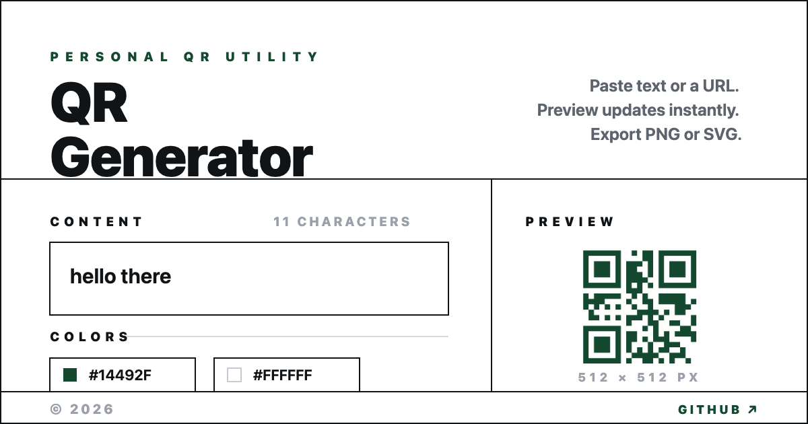

# QR Generator

A fast, no-fuss QR code generator. Paste text or a URL, preview instantly, and download a clean PNG or SVG.



## Features

- **Live preview** — QR updates automatically as you type
- **PNG & SVG export** — download with auto-generated, content-based filenames
- **Custom colors** — pick QR foreground and background; lower opacity for a transparent PNG background
- **Logo overlay** — drop a centered logo; error correction is raised automatically to keep the code scannable
- **Explicit states** — distinct idle, generating, ready, and failed states
- **Accessible** — WCAG AA contrast, keyboard access, focus visibility

## Tech Stack

- [Svelte 5](https://svelte.dev/)
- [TypeScript](https://www.typescriptlang.org/)
- [Vite](https://vite.dev/)
- [Tailwind CSS 4](https://tailwindcss.com/)
- [qrcode](https://www.npmjs.com/package/qrcode)

## Getting Started

```bash
# Install dependencies
npm install

# Start the dev server
npm run dev

# Build for production
npm run build

# Preview the production build
npm run preview

# Type-check
npm run check
```

## License

Personal project. See [GitHub](https://github.com/zulfaza/qr-gen).
